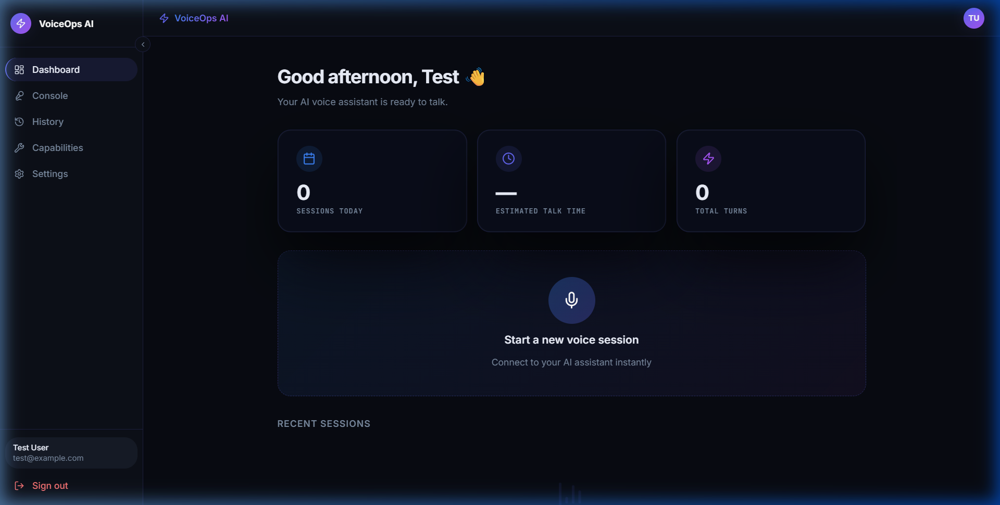
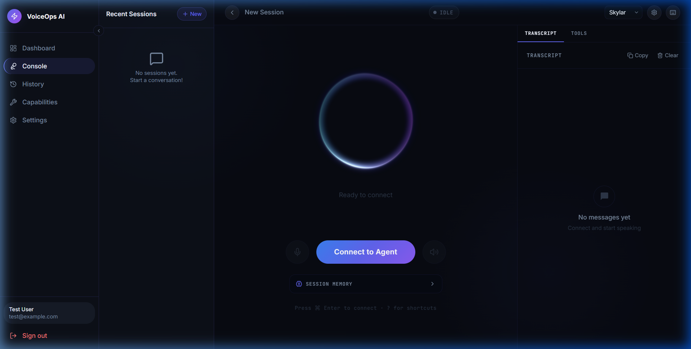
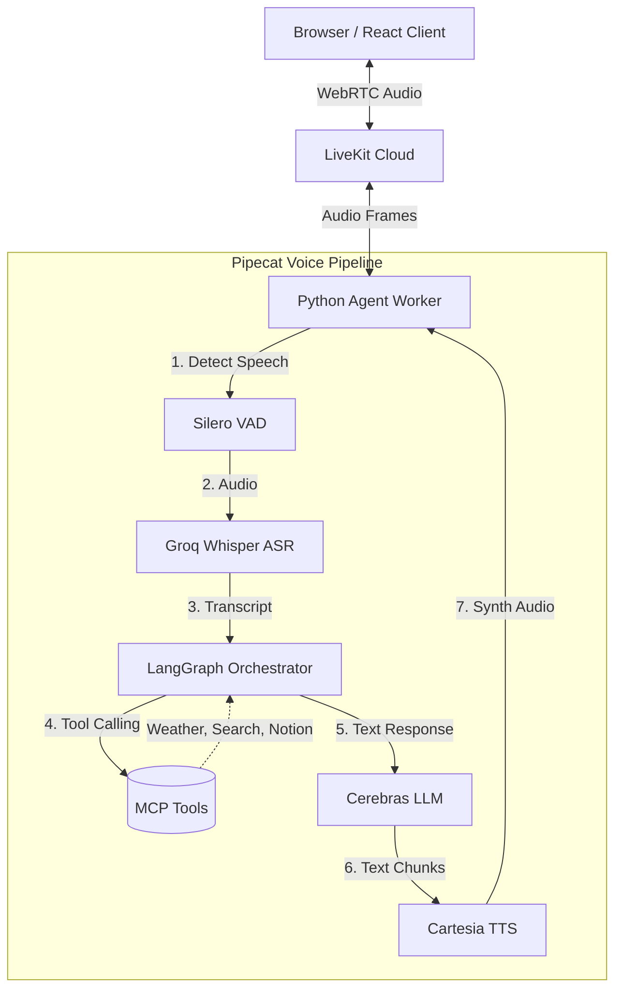

<div align="center">
  <h1>🎙️ Voice AI Agent</h1>
  <p><strong>A hyper-fast, full-stack voice assistant built with Groq Whisper, Cerebras, and Cartesia</strong></p>

  <!-- Shields.io Badges -->
  <p>
    
    
    
    
    
    
  </p>

  
</div>

---

## 📖 Overview

Voice AI Agent is an end-to-end, ultra-low latency conversational AI application. Powered by cutting-edge AI infrastructure, this agent listens, thinks, and responds in real-time. It seamlessly integrates a state-of-the-art **WebRTC** transport pipeline with **Groq Whisper** for speech-to-text, **Cerebras LLM** for intelligent reasoning, and **Cartesia Sonic** for human-like speech synthesis. 

Equipped with LangGraph and various MCP (Model Context Protocol) tools, the assistant is capable of searching the web, checking the weather, evaluating offline mathematical expressions, and logging notes to Notion.

> [!NOTE]  
> **Looking for more details?** Please check the [`docs/`](docs/) folder for an executive overview, detailed implementation plans, setup instructions, and other architectural contracts.

## ✨ Features

- **⚡ Sub-500ms End-to-End Latency**: Achieved by utilizing Groq's LPU hardware for Whisper inference and Cerebras for ultra-fast text generation.
- **🌐 Real-Time Audio Streaming**: Robust WebRTC transport powered by LiveKit Cloud for seamless two-way audio.
- **🧠 LangGraph Orchestration**: Robust state management and tool-calling router with a persistent short-term conversation memory.
- **🛠️ MCP Tool Integrations**:
  - `Web Search`: Real-time internet search via DuckDuckGo.
  - `News Search`: Latest news fetching.
  - `Calculator`: Offline math evaluator utilizing Python AST parsing.
  - `Weather`: Live weather tracking via Open-Meteo API.
  - `Notion Notes`: Sync notes and logs directly to your Notion databases.
- **💻 Modern React Dashboard**: Beautiful, responsive, dark-mode frontend built with Vite, Tailwind CSS, Zustand, and Framer Motion.
- **🔐 Secure Authentication**: JWT-based auth via MongoDB.

---

## 📸 Screenshots

<details>
<summary><b>View Screenshots</b></summary>
<br/>

### Dashboard & Analytics


### Real-Time Voice Console


</details>

---

## 🛠️ Tech Stack

### Backend
* **Python 3.12+**
* **FastAPI** & **Uvicorn**
* **LiveKit Agents & Pipecat AI** (Audio Pipeline)
* **LangChain & LangGraph** (Agent Framework)
* **Groq SDK** (Whisper-large-v3-turbo ASR)
* **Cerebras API** (gpt-oss-120b LLM)
* **Cartesia** (Sonic TTS)
* **MongoDB** (Motor async driver)

### Frontend
* **React 19 & TypeScript**
* **Vite**
* **Tailwind CSS**
* **Zustand** (State management)
* **LiveKit Client SDK**
* **Framer Motion**

---

## 📐 Architecture



---

## 📂 Project Structure

```text
Voice_agent/
├── backend/                  # FastAPI & Python Pipeline
│   ├── agent/                # LangGraph nodes, state, and prompts
│   ├── api/                  # FastAPI REST endpoints
│   ├── auth/                 # JWT security & user deps
│   ├── db/                   # MongoDB connection logic
│   ├── mcp/                  # FastMCP server integration
│   ├── pipeline/             # Pipecat pipeline (VAD → STT → LLM → TTS)
│   ├── tools/                # Integrations (Weather, Notion, DDGS)
│   └── main.py               # Application entrypoint
├── frontend/                 # React UI Client
│   ├── src/                  # React components, stores, hooks
│   ├── package.json          # Vite & dependencies config
│   └── tailwind.config.js    # Tailwind theme specifications
├── docs/                     # Architecture & Planning documents
├── tests/                    # Pytest suites
└── assets/                   # Media for documentation
```

---

## 🚀 Installation & Setup

### Prerequisites
- Python 3.12 or higher
- Node.js 18+ and npm
- MongoDB running locally or on Atlas

### 1. Clone the repository

```bash
git clone https://github.com/your-username/voice_agent.git
cd voice_agent
```

### 2. Backend Setup

Create and activate a virtual environment, then install dependencies:

```bash
# Windows
python -m venv .venv
.venv\Scripts\activate

# macOS / Linux
python -m venv .venv
source .venv/bin/activate

# Install requirements
pip install -r requirements.txt
```

### 3. Frontend Setup

Navigate to the frontend directory and install NPM packages:

```bash
cd frontend
npm install
```

---

## 🔑 Environment Variables

Copy the `.env.example` file to `.env` in the root directory:

```bash
cp .env.example .env
```

Fill in the required keys. (All major integrations offer generous free tiers):

```ini
# LiveKit Cloud (Free tier)
LIVEKIT_URL=wss://your-project.livekit.cloud
LIVEKIT_API_KEY=your_key
LIVEKIT_API_SECRET=your_secret

# AI Models
CEREBRAS_API_KEY=your_cerebras_key
GROQ_API_KEY=your_groq_key
CARTESIA_API_KEY=your_cartesia_key

# Database and Security
MONGODB_URI=mongodb://localhost:27017
JWT_SECRET_KEY=your_random_secret_string

# Optional: Notion Integration
NOTION_API_KEY=your_notion_secret
NOTION_DATABASE_ID=your_notion_db_id
```

---

## 💡 Usage Examples

### Starting the Application

You can start both servers simultaneously by running the backend Uvicorn server and Vite dev server.

**Backend (from the root directory):**
```bash
uvicorn backend.main:app --host 0.0.0.0 --port 8000 --reload
```

**Frontend (from the frontend directory):**
```bash
npm run dev
```

### Connecting via the Client
1. Open `http://localhost:5173` in your browser.
2. Sign up and log in.
3. Wait for the engine warm-up sequence (compiling graph & establishing connections).
4. Navigate to the **Console**.
5. Click **Connect to Agent** and speak into your microphone.
6. Try saying: *"What is the weather in New York?"* or *"Search the web for the latest AI news."*

---

## 🧪 Testing

The backend is thoroughly tested with `pytest`. It includes unit tests for tools, memory, configurations, and end-to-end pipeline latency simulation.

To run the test suite:
```bash
pytest tests/ -v
```

---

## 🗺️ Roadmap

- [ ] **Long-term Memory:** Integrate vector database embeddings for recalling past user contexts across sessions.
- [ ] **Multi-Agent Swarm:** Allow the primary agent to hand off complex tasks to specialized sub-agents.
- [ ] **Vision Capabilities:** Integrate image input through LiveKit's video tracks to allow the agent to "see" your screen or camera.
- [ ] **Dockerization:** Add Docker and Docker-Compose support for seamless one-click production deployments.
- [ ] **More MCP Tools:** Add email querying and calendar integrations.

---

## 🤝 Contributing

Contributions are welcome! Please follow these steps:
1. Fork the project.
2. Create your feature branch (`git checkout -b feature/AmazingFeature`).
3. Commit your changes (`git commit -m 'Add some AmazingFeature'`).
4. Push to the branch (`git push origin feature/AmazingFeature`).
5. Open a Pull Request.

Please read `CODE_OF_CONDUCT.md` for details on our code of conduct.

---

## 📝 License

Distributed under the MIT License. See `LICENSE` for more information.

<div align="center">
  <sub>Built with ❤️ by AI Enthusiasts</sub>
</div>
