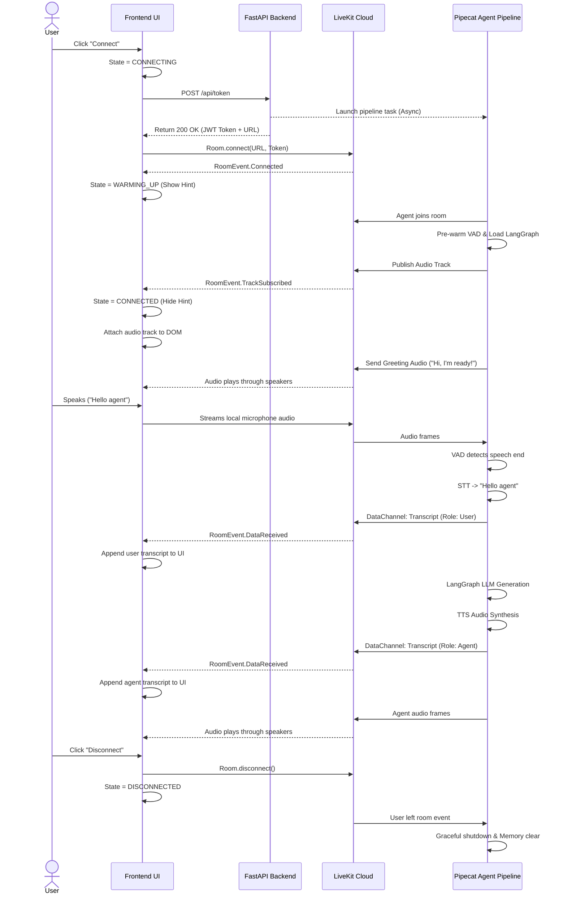

# Application Event Flow

This document outlines the sequential flow of events from the moment a user initiates a session to the point they disconnect. Understanding this flow is crucial for synchronizing the frontend UI state with the backend LiveKit pipeline.

## 1. Complete Session Sequence Diagram



## 2. Key Synchronization Points

1. **The Warmup Gap:** There is a distinct gap between `Room.connect()` succeeding (Frontend hits LiveKit) and `TrackSubscribed` firing (Pipecat agent is fully booted and broadcasting). This takes 3-5 seconds. The frontend MUST handle this gracefully by showing a loading/warming up indicator.
2. **The Greeting:** Do not attempt to play your own greeting sound on the frontend. The agent pipeline is hardcoded to say "Hi, I'm ready!" the exact millisecond its audio track is established.
3. **Data Channel Transcripts:** Transcripts arrive asynchronously via LiveKit's Data Channel. They are pushed by the backend pipeline as soon as STT (for user) or LLM text (for agent) is available, which is usually *before* the TTS audio finishes playing.

---

## 3. Barge-In (Interruption) Sequence

The backend handles barge-in fully — no extra frontend API call required. The frontend only needs to react to the DataChannel events that naturally follow.

```mermaid
sequenceDiagram
    actor User
    participant UI as Frontend UI
    participant LK as LiveKit Cloud
    participant Pipeline as Pipecat Pipeline
    participant LLM as LangGraphLLMService
    participant TTS as Cartesia TTS

    Note over Pipeline,TTS: Agent is currently speaking...
    TTS->>LK: Agent audio frames (playing)
    LK-->>UI: 🔊 Agent audio heard by user

    User->>UI: Speaks (interrupts agent)
    UI->>LK: Streams mic audio
    LK->>Pipeline: Audio frames

    Pipeline->>Pipeline: VAD detects speech (VADUserStartedSpeakingFrame)
    Pipeline->>Pipeline: InterruptionHandlerProcessor checks: bot_is_speaking=True?
    alt elapsed > 200ms echo-protection window
        Pipeline->>Pipeline: broadcast_interruption() → InterruptionFrame
        Pipeline->>TTS: InterruptionFrame → Cartesia stops immediately
        Pipeline->>LLM: InterruptionFrame → sets _was_interrupted=True
        Note over Pipeline: Pipeline clean; ready for new turn
        Pipeline->>Pipeline: Groq STT transcribes user speech
        Pipeline->>LK: DataChannel: { type: "transcript", role: "user", text: "..." }
        LK-->>UI: RoomEvent.DataReceived (user transcript)
        UI->>UI: ✅ Clear SPEAKING state → show new user transcript bubble
        Pipeline->>LLM: Run new agent turn (with "acknowledge interruption" system note)
        LLM->>LK: DataChannel: { type: "transcript", role: "agent", text: "Gotcha, ..." }
        LK-->>UI: RoomEvent.DataReceived (agent transcript)
        UI->>UI: Append agent transcript (do NOT strip acknowledgement word)
    else elapsed < 200ms (echo protection)
        Pipeline->>Pipeline: Ignore — likely speaker echo, fall through normally
    end
```

## 4. What the Frontend MUST Do for Barge-In

| Requirement | Why |
| :--- | :--- |
| **Never mute/suppress the local mic** while agent is speaking | The backend VAD needs to receive the user's audio to detect the interruption |
| **Immediately transition Orb to LISTENING** when a new user DataChannel transcript arrives mid-speech | The audio will stop abruptly; the UI should not wait for a `BotStoppedSpeaking` event |
| **Do not strip acknowledgement words** from agent transcripts after an interruption | The LLM is instructed to start responses with "Gotcha", "Sure", etc. — these are intentional |
| **Do not replay** any unfinished agent TTS audio after interruption | The pipeline resets cleanly; the next response is fresh |
