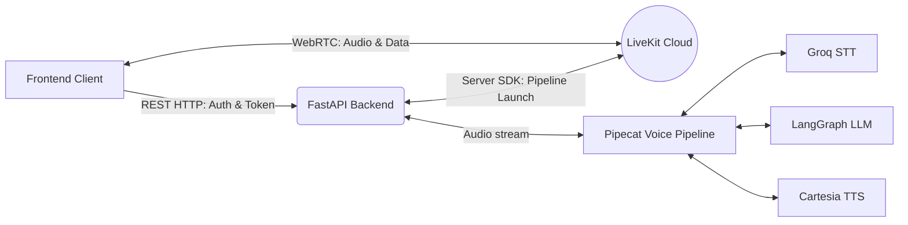

# Frontend Handoff: AI Voice Agent

## 1. Executive Summary

Welcome to the frontend handoff for the Voice-enabled Autonomous AI Assistant. This document and its accompanying artifacts provide all the necessary information to build a production-ready, enterprise-grade frontend application for the voice agent without needing to dive into the backend Python codebase.

The backend provides a RESTful API for user authentication and session management, and utilizes **LiveKit** as the WebRTC transport layer for real-time audio streaming. The AI pipeline runs entirely on the backend, processing voice input, generating responses via a LangGraph-based LLM, and synthesizing speech.

**Goal:** The frontend team must build a resilient, beautiful, and highly responsive web application that authenticates users, connects them to the AI agent via LiveKit, and provides visual feedback (transcripts, audio visualizers, and state indicators) during the conversation.

## 2. Core Technologies & Recommendations

While the backend does not dictate the frontend framework, we highly recommend the following stack for an enterprise-grade experience:

- **Framework:** React 18+ (Next.js or Vite)
- **Voice SDK:** LiveKit Client SDK for Web (`livekit-client`)
- **State Management:** Zustand or React Context (for UI state and LiveKit room state)
- **Styling:** TailwindCSS or vanilla CSS with CSS Variables (refer to Design System)
- **Data Fetching:** Axios or Fetch API for REST endpoints

## 3. System Context Diagram

## 4. Documentation Index

To implement the frontend successfully, please read the following documents in order:

1. **[API Contract](./api_contract.md):** REST endpoints for authentication and token generation.
2. **[LiveKit Contract](./livekit_contract.md):** WebRTC connection details, track subscription, and data channel messaging.
3. **[Frontend Architecture](./frontend_architecture.md):** Recommended folder structure and service layer design.
4. **[UI State Machine](./ui_state_machine.md):** Core connection states and transition logic.
5. **[Frontend Components](./frontend_components.md):** Breakdown of essential UI components and their responsibilities.
6. **[Event Flow](./event_flow.md):** Sequence diagrams for the complete user journey.
7. **[Frontend API Abstraction](./frontend_api.md):** Suggested service layer implementations.
8. **[Error Handling](./error_handling.md):** Edge cases, network failures, and recovery strategies.
9. **[Design System](./design_system.md):** Typography, color palettes, and animation specifications.

## 5. Important Backend Behaviors

- **Automatic Pipeline Launch:** When the frontend requests a LiveKit token via `POST /api/token`, the backend automatically launches the Pipecat voice pipeline for that room. The frontend *does not* need to explicitly trigger the agent.
- **Agent Warmup Time:** It takes approximately 3-5 seconds for the agent pipeline to pre-warm models and connect to LiveKit. The frontend must display a "Warming up" state during this period.
- **Audio Greeting:** The agent will automatically say "Hi, I'm ready!" exactly when it finishes connecting. The frontend must subscribe to the audio track to hear this.
- **Transcripts:** Real-time transcripts are sent via LiveKit Data Channels, not via REST or WebSockets.
