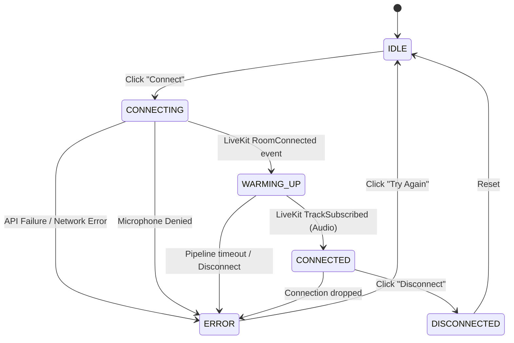

# UI State Machine

The voice agent frontend is heavily state-driven. Managing the transition between connection phases accurately is critical for user experience, specifically to hide the backend pipeline latency (3-5 seconds).

## 1. Core States

| State | Description |
| :--- | :--- |
| **`IDLE`** | Initial state. User is authenticated but has not initiated a call. "Connect" button is visible. |
| **`CONNECTING`** | User clicked Connect. App is fetching the token via API or connecting to the LiveKit WebSocket. |
| **`WARMING_UP`** | WebSocket connected, but audio track not yet received. The Pipecat pipeline is booting up. |
| **`CONNECTED`** | Agent audio track received. The agent is active and listening. "Disconnect" button visible. |
| **`ERROR`** | A failure occurred (network drop, auth failure, mic denied). |
| **`DISCONNECTED`** | User explicitly ended the call or the agent hung up. Returns to IDLE effectively. |

## 2. State Transition Diagram



## 3. UI Mapping by State

The UI should react to these states as follows:

### State: IDLE
- **Status Indicator:** "Not connected" (Gray dot)
- **Controls:** Show `Connect` button. Hide `Disconnect`.
- **Feedback:** Visualizer hidden, transcripts hidden (or cleared).

### State: CONNECTING
- **Status Indicator:** "Connecting to server..." (Yellow spinning dot)
- **Controls:** `Connect` button disabled (prevent double clicks).
- **Feedback:** Visualizer hidden.

### State: WARMING_UP
- **Status Indicator:** "Warming up agent..." (Orange pulsing dot)
- **Controls:** Show `Disconnect` button (in case they want to abort).
- **Feedback:** Display `StartupHint` component explaining the 3-5s delay. Visualizer can be set to an "idle active" state (e.g., slow wave).

### State: CONNECTED
- **Status Indicator:** "Connected — speak now!" (Green dot)
- **Controls:** Show `Disconnect` button. Show `Mute` toggle.
- **Feedback:** Hide `StartupHint`. Visualizer active and responding. `TranscriptBox` visible.

### State: ERROR
- **Status Indicator:** "Connection failed" (Red dot)
- **Controls:** Show `Connect` button (to retry).
- **Feedback:** Display specific error message banner.

## 4. Implementation Detail

When using React, this state machine can be implemented cleanly using a string literal type and a `useState` or `useReducer` hook inside the `useVoiceAgent` custom hook.

```typescript
type VoiceState = 'IDLE' | 'CONNECTING' | 'WARMING_UP' | 'CONNECTED' | 'ERROR' | 'DISCONNECTED';
```
